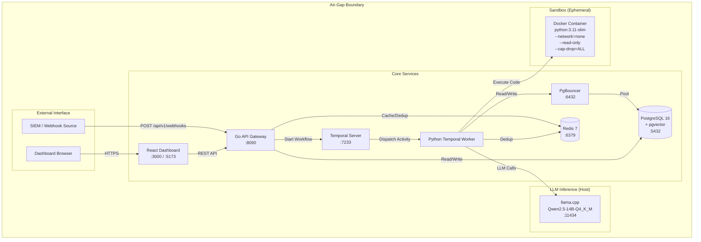

# ZOVARC Platform Architecture

**Version:** v1.1.0
**Commit:** bd01707
**Date:** 2026-03-22
**Status:** Production-Ready (Demo-validated)

---

## Table of Contents

1. [Overview](#overview)
2. [System Architecture](#system-architecture)
3. [V2 Investigation Pipeline](#v2-investigation-pipeline)
4. [Component Inventory](#component-inventory)
5. [Air-Gap Boundary](#air-gap-boundary)
6. [Data Flow](#data-flow)
7. [Go API Gateway](#go-api-gateway)
8. [Python Worker](#python-worker)
9. [Database Layer](#database-layer)
10. [Dashboard](#dashboard)
11. [LLM Infrastructure](#llm-infrastructure)
12. [Sandbox Execution](#sandbox-execution)
13. [Security Architecture](#security-architecture)
14. [Authentication & Authorization](#authentication--authorization)
15. [Infrastructure Services](#infrastructure-services)
16. [Testing](#testing)
17. [Deployment](#deployment)
18. [Known Gaps](#known-gaps)

---

## Overview

ZOVARC is an AI-powered SOC (Security Operations Center) automation platform. It receives security alerts from SIEM systems, uses local LLMs to generate investigation code, executes that code in sandboxed containers, and returns structured findings with MITRE ATT&CK mapping, risk scores, IOC extraction, and remediation recommendations.

**Core value proposition:** Automate Tier-1 SOC analyst work---triage alerts, investigate indicators, correlate entities, and generate incident reports---using locally-hosted LLMs with zero data egress. Designed for air-gapped, on-premises deployment in compliance-constrained environments (GDPR, HIPAA, NERC CIP, CMMC).

### Key Design Principles

- **Air-gap capable:** The complete platform runs on a single machine with no outbound network connectivity. The LLM, sandbox, database, and all services run locally.
- **Local-first inference:** All LLM processing runs on local GPU hardware (RTX 3050 / 4GB VRAM minimum). Cloud providers are optional fallbacks only.
- **LLM output is untrusted:** Four-layer sandbox (AST prefilter, Docker isolation, seccomp, kill timer) protects against malicious code generation.
- **Multi-tenant isolation:** Tenant-scoped data, per-tenant rate limits, RBAC, and audit logging.
- **Durable execution:** Temporal workflows survive restarts, retries, and partial failures.
- **Complete audit trail:** Every LLM call is logged with input, output, model, tokens, and latency.

---

## System Architecture



### ASCII Diagram (for non-Mermaid renderers)

```
                              AIR-GAP BOUNDARY
  ================================================================
  |                                                              |
  |   SIEM ──webhook──> Go API (:8090) ──> Temporal (:7233)    |
  |                        |                    |                |
  |   Browser ──> Dashboard (:3000)             v                |
  |                        |            Python Worker            |
  |                        v               |       |             |
  |                   PostgreSQL (:5432)   |       |             |
  |                   via PgBouncer        |       |             |
  |                   + Redis (:6379)      v       v             |
  |                                  llama.cpp  Sandbox          |
  |                                  (:11434)   (Docker)         |
  |                                  [HOST]     --network=none   |
  |                                                              |
  ================================================================
                    NO OUTBOUND CONNECTIONS
```

---

## V2 Investigation Pipeline

The V2 pipeline is a five-stage workflow orchestrated by Temporal. Each stage is an independent activity that can be retried on failure.

```
SIEM Alert --> Go API (:8090) --> Temporal: InvestigationWorkflowV2 -->

  Stage 1 INGEST:  dedup (Redis) -> PII mask -> skill retrieval     [NO LLM]
  Stage 2 ANALYZE: template fill OR full LLM code generation        [LLM Call 1]
  Stage 3 EXECUTE: AST prefilter -> Docker sandbox                  [NO LLM]
  Stage 4 ASSESS:  verdict -> LLM summary -> FP confidence          [LLM Call 2]
  Stage 5 STORE:   agent_tasks + investigations + memory            [NO LLM]

  --> Structured Verdict (findings, IOCs, recommendations, risk score, MITRE mapping)
```

### Stage Details

| Stage | File | LLM? | Input | Output | Latency |
|-------|------|------|-------|--------|---------|
| 1. INGEST | `worker/stages/ingest.py` | No | Alert JSON | IngestOutput (deduped, PII-masked, skill selected) | <100ms |
| 2. ANALYZE | `worker/stages/analyze.py` | Yes | IngestOutput | AnalyzeOutput (Python investigation code) | 10-60s |
| 3. EXECUTE | `worker/stages/execute.py` | No | AnalyzeOutput (code) | ExecuteOutput (stdout, stderr, exit code, IOCs) | 1-120s |
| 4. ASSESS | `worker/stages/assess.py` | Yes | ExecuteOutput | AssessOutput (verdict, risk score, recommendations) | 10-40s |
| 5. STORE | `worker/stages/store.py` | No | All prior outputs | Database records | <100ms |

### Supporting Modules

| Module | File | Purpose |
|--------|------|---------|
| LLM Gateway | `worker/stages/llm_gateway.py` | Audit logging, timeout handling for all LLM calls |
| Model Router | `worker/stages/model_router.py` | Severity-based model tier selection |
| Model Config | `worker/stages/model_config.yaml` | Model tier definitions (fast/standard/reasoning) |
| Sandbox Policy | `worker/stages/sandbox_policy.yaml` | Declarative sandbox configuration |
| MITRE Mapping | `worker/stages/mitre_mapping.py` | Task-type to MITRE ATT&CK technique mapping |
| Registration | `worker/stages/register.py` | Activity and workflow registration for Temporal |

---

## Component Inventory

| Component | Technology | Port | Docker Service | Status | Purpose |
|-----------|-----------|------|----------------|--------|---------|
| API Gateway | Go 1.22 + Gin | 8090 | `api` | Core | Auth, RBAC, task dispatch, 78 endpoints |
| Worker | Python 3.11 + Temporal SDK | -- | `worker` | Core | Investigation pipeline execution |
| Temporal | Temporal 1.24.2 | 7233 | `temporal` | Core | Durable workflow orchestration |
| Temporal UI | Temporal Web UI | 8080 | `temporal` | Core | Workflow monitoring |
| PostgreSQL | PostgreSQL 16 + pgvector | 5432 | `postgres` | Core | Investigation storage, 76+ tables |
| PgBouncer | PgBouncer | 6432 | `pgbouncer` | Core | Connection pooling |
| Redis | Redis 7 Alpine | 6379 | `redis` | Core | Dedup, rate limiting, caching |
| Dashboard | React 19 + Vite 7 + Tailwind 4 | 3000 (Docker) / 5173 (dev) | `dashboard` | Core | Investigation management UI |
| llama.cpp | llama-server | 11434 | Host process (not Docker) | Core | LLM inference |
| NATS | NATS Server | 4222 | `nats` | Optional | Event streaming |
| LiteLLM | LiteLLM Proxy | 4000 | `litellm` | Optional | LLM routing proxy |
| TEI | HuggingFace TEI | 8001 | `tei` | Optional | Text embeddings |

**Note:** As of v1.1.0, NATS, LiteLLM, and TEI are moved to `docker-compose.optional.yml`. The primary LLM path uses llama.cpp directly on the host via `http://host.docker.internal:11434/v1/chat/completions`.

---

## Air-Gap Boundary

ZOVARC is designed to run within a complete air-gap. The boundary is defined as follows:

### Inside the Boundary (Required)

- All 6 core Docker containers (postgres, redis, pgbouncer, temporal, api, worker)
- llama.cpp running on the host GPU
- Model weights stored locally on disk
- Dashboard served via nginx (Docker) or Vite dev server (host)
- All investigation data, LLM interactions, and audit logs

### Outside the Boundary (Nothing)

- No cloud API calls
- No telemetry or usage reporting
- No model weight downloads at runtime (pre-staged)
- No package installations at runtime (pre-built images)
- No DNS resolution required
- No NTP required (system clock is sufficient)

### Network Connections

| Source | Destination | Protocol | Direction | Purpose |
|--------|------------|----------|-----------|---------|
| Browser | Dashboard (:3000) | HTTPS | Inbound | User interface |
| SIEM | API (:8090) | HTTPS | Inbound | Alert webhooks |
| API | PostgreSQL (:5432) | TCP | Internal | Data storage |
| API | Redis (:6379) | TCP | Internal | Caching |
| API | Temporal (:7233) | gRPC | Internal | Workflow dispatch |
| Worker | Temporal (:7233) | gRPC | Internal | Activity execution |
| Worker | PgBouncer (:6432) | TCP | Internal | Data storage |
| Worker | Redis (:6379) | TCP | Internal | Dedup |
| Worker | llama.cpp (:11434) | HTTP | Internal* | LLM inference |
| Worker | Docker daemon | Unix socket | Internal | Sandbox creation |

*Worker connects to llama.cpp via `host.docker.internal:11434` when running in Docker.

**Zero outbound connections exist.** The sandbox containers are created with `--network=none`, removing even the internal Docker network.

---

## Data Flow

### Investigation Lifecycle

```
1. SIEM sends alert JSON via POST /api/v1/webhooks/:source_id/alert
   (or analyst creates task via POST /api/v1/tasks)

2. Go API validates auth (JWT), extracts tenant_id, writes to agent_tasks table,
   starts Temporal workflow InvestigationWorkflowV2

3. Temporal dispatches Stage 1 (INGEST) to Python worker:
   - Check Redis for duplicate (SHA-256 content hash)
   - Apply PII masking (regex-based)
   - Select skill template from library (11 templates)

4. Temporal dispatches Stage 2 (ANALYZE) to Python worker:
   - If template found: fill template with alert parameters
   - If no template: send prompt to llama.cpp, receive Python code
   - LLM call logged to llm_audit_log table

5. Temporal dispatches Stage 3 (EXECUTE) to Python worker:
   - AST prefilter checks code for forbidden imports/patterns
   - Docker sandbox runs code (--network=none, --read-only, seccomp)
   - Capture stdout (JSON), stderr, exit code, execution time

6. Temporal dispatches Stage 4 (ASSESS) to Python worker:
   - Send execution results to llama.cpp for verdict
   - Receive risk score, findings, IOCs, recommendations
   - LLM call logged to llm_audit_log table

7. Temporal dispatches Stage 5 (STORE) to Python worker:
   - Write investigation record to PostgreSQL
   - Update investigation_memory for cross-correlation
   - Mark agent_task as completed/failed

8. Dashboard polls GET /api/v1/tasks/:id every 2 seconds
   - Displays real-time progress, then final verdict
```

### Data at Rest

| Data | Storage | Encryption | Retention |
|------|---------|-----------|-----------|
| Investigation records | PostgreSQL | TDE (if configured) | Configurable per tenant |
| LLM audit logs | PostgreSQL (partitioned) | TDE | 90 days default |
| Model weights | Host filesystem | At-rest encryption (OS) | Permanent |
| Redis cache | In-memory | N/A | TTL-based eviction |
| Sandbox output | Ephemeral (container destroyed) | N/A | Not persisted |

---

## Go API Gateway

**Location:** `api/`
**Framework:** Gin 1.9.1
**Endpoints:** 78 across 27 handler files

### Endpoint Groups

| Group | Count | Auth Required | Purpose |
|-------|-------|--------------|---------|
| Auth | 6 | No (rate limited) | Login, register, refresh, logout, SSO |
| Tasks | 8 | Yes | Investigation CRUD, steps, timeline, streaming |
| Admin | 20+ | Admin role | Tenants, playbooks, models, retention, kill switch |
| Webhooks | 4 | HMAC or JWT | SIEM alert ingestion, delivery tracking |
| Shadow Mode | 5 | Yes | A/B model comparison |
| Automation | 5 | Yes (admin for mutations) | Kill switch, controls |
| Quotas | 4 | Yes (admin for mutations) | Token usage limits |

### Middleware Stack

1. **CORS** -- Origins: localhost:3000, localhost:5173
2. **Security Headers** -- HSTS, X-Frame-Options, CSP
3. **Structured Logging** -- JSON with request context
4. **Auth Rate Limiting** -- 10 attempts per 15 minutes per IP
5. **JWT Validation** -- Access token from header or httpOnly cookie
6. **RBAC Check** -- admin, analyst, viewer, api_key roles
7. **Tenant Scoping** -- tenant_id from JWT, enforced on all queries
8. **Audit Logging** -- All mutations logged to audit_events table

---

## Python Worker

**Location:** `worker/`
**Framework:** Temporal Python SDK
**Pipeline:** V2 five-stage (see above)

### Key Modules

| Module | Location | Purpose |
|--------|----------|---------|
| V2 Pipeline Stages | `worker/stages/` | Five-stage investigation pipeline (1392 lines) |
| LLM Gateway | `worker/stages/llm_gateway.py` | Centralized audit logging for all LLM calls |
| Model Router | `worker/stages/model_router.py` | Severity-based model selection |
| MITRE Mapping | `worker/stages/mitre_mapping.py` | ATT&CK technique mapping per investigation type |
| Legacy Activities | `worker/_legacy_activities.py` | Shared activities (fetch_task, log_audit) |
| Skill Templates | `worker/skills/` | 11 pre-validated investigation templates |
| Security | `worker/security/` | Injection detection, prompt sanitization |
| Intelligence | `worker/intelligence/` | Blast radius, FP analysis, cross-tenant correlation |
| Detection | `worker/detection/` | Sigma rule generation, pattern mining |
| Response | `worker/response/` | SOAR playbook execution, approval gates |

---

## Database Layer

**Engine:** PostgreSQL 16 with pgvector extension
**Connection pooling:** PgBouncer
**Migrations:** 47 files in `migrations/` (001 through 047)
**Tables:** 76+

### Table Categories

| Category | Key Tables | Purpose |
|----------|-----------|---------|
| Core | tenants, users, roles, permissions | Multi-tenant identity |
| Investigation | agent_tasks, investigations, investigation_steps | Investigation lifecycle |
| V2 Pipeline | llm_audit_log, investigation_memory | LLM audit trail, cross-correlation |
| Entity Graph | entities, entity_edges | IOC correlation |
| Detection | sigma_rules, detection_patterns | Generated detection content |
| Response | playbooks, playbook_actions, approval_gates | SOAR automation |
| LLM | llm_call_log, model_registry, ab_tests | Model management |
| Security | audit_events, auth_attempts | Audit trail |
| Config | tenant_config, webhooks, retention_policies | Per-tenant settings |

### Key Schema Patterns

- **Tenant isolation:** Every table includes `tenant_id` in WHERE clauses
- **pgvector:** Investigation embeddings for semantic search (768-dim)
- **Table partitioning:** High-volume tables (audit_events, llm_call_log) use range partitioning
- **Singular table names:** `investigation_memory` (not memories) -- see known issues

---

## Dashboard

**Location:** `dashboard/`
**Stack:** React 19 + Vite 7 + Tailwind 4 + TypeScript 5.9
**Pages:** 15

### Page Inventory

| Page | Route | Purpose |
|------|-------|---------|
| TaskList | `/` | Investigation list with filters |
| TaskDetail | `/tasks/:id` | Full investigation detail with steps, MITRE mapping, export |
| NewTask | `/tasks/new` | Create new investigation |
| Login | `/login` | Authentication |
| DemoPage | `/demo` | C2 beacon demo scenario |
| AdminPanel | `/admin` | Tenant management, approvals |
| ApprovalQueue | `/approvals` | Pending human approvals |
| PlaybookBuilder | `/playbooks/new` | Visual playbook creation |
| Playbooks | `/playbooks` | Playbook management |
| SIEMAlerts | `/siem-alerts` | Alert ingestion dashboard |
| ThreatIntel | `/threat-intel` | Threat intelligence feeds |
| EntityGraph | `/entities` | IOC relationship graph |
| CostDashboard | `/costs` | Investigation cost tracking |
| LogSources | `/log-sources` | SIEM integration management |
| Settings | `/settings` | User preferences |

### Key Components

| Component | Purpose |
|-----------|---------|
| MitreTimeline | MITRE ATT&CK timeline visualization per investigation |
| InvestigationWaterfall | Step-by-step progress visualization |
| ExecutiveSummary | Key metrics ribbon |
| SovereigntyBanner | Data sovereignty compliance indicator |
| DataFlowBadge | Visual data flow indicators |
| StepDetailPanel | Expandable investigation step details |

---

## LLM Infrastructure

### Current Configuration (v1.1.0)

| Parameter | Value |
|-----------|-------|
| Runtime | llama.cpp (native binary on host) |
| Model | Qwen2.5-14B-Instruct-Q4_K_M |
| Model Size | 8.1 GB |
| GPU Layers | 20 (offloaded to GPU) |
| VRAM Usage | ~3.8 GB |
| Inference Speed | ~4 tokens/second |
| Port | 11434 (host) |
| Worker URL | `http://host.docker.internal:11434/v1/chat/completions` |

### Model Tiers

| Tier | Purpose | Model | Hardware Requirement |
|------|---------|-------|---------------------|
| Fast | Triage, classification | qwen2.5:14b (or Nemotron 4B) | Any NVIDIA GPU |
| Standard | Full investigation | 32B or cloud 70B | A6000 (48GB) or cloud |
| Reasoning | Complex analysis | 70B+ | A100 (80GB) or cloud |

### Why Not LiteLLM/vLLM?

As of v1.1.0, LiteLLM and vLLM are moved to optional services. llama.cpp provides:
- Native Windows support (no WSL overhead for inference)
- Lower VRAM overhead for quantized models
- Simpler deployment (single binary)
- OpenAI-compatible API on port 11434

---

## Sandbox Execution

See `docs/SANDBOX_SECURITY.md` for the complete security model.

### Summary

| Layer | Mechanism | What It Blocks |
|-------|-----------|---------------|
| 1. AST Prefilter | Python AST analysis | Forbidden imports (os, sys, subprocess, socket), dangerous patterns (eval, exec) |
| 2. Docker Container | Process isolation | Network access, filesystem writes, privilege escalation |
| 3. Seccomp Profile | Syscall filtering | mount, ptrace, kexec_load, raw sockets, namespace escape |
| 4. Kill Timer | Execution timeout | Infinite loops, resource exhaustion, cryptomining |

### Sandbox Policy

All sandbox parameters are configured via `worker/stages/sandbox_policy.yaml`, a declarative YAML file that can be audited by customer security teams without reading source code.

---

## Security Architecture

### Authentication Flow

```
Register -> Login -> JWT Access Token (15min) -> Refresh Token (7d, httpOnly cookie)
                          |
                          v
                    RBAC Check (admin / analyst / viewer / api_key)
                          |
                          v
                    Tenant Scoping (tenant_id from JWT claims)
```

### Security Controls

| Control | Implementation |
|---------|---------------|
| JWT signing | HS256 with 32+ character secret (enforced at startup) |
| Password hashing | bcrypt |
| Rate limiting | Redis-backed, 10 attempts / 15 min per IP |
| CORS | Strict origin whitelist |
| CSRF | httpOnly cookies + SameSite |
| 2FA | TOTP (RFC 6238) |
| SSO | OIDC with JWKS verification |
| API keys | HMAC-signed, admin-managed |
| Audit | All mutations logged with user, tenant, timestamp |
| Kill switch | Emergency disable of all LLM code execution |

---

## Infrastructure Services

### Docker Compose (Core)

```bash
docker compose up -d
# Starts: postgres, redis, pgbouncer, temporal, api, worker
```

### Docker Compose (Optional)

```bash
docker compose -f docker-compose.optional.yml up -d
# Starts: nats, litellm, tei
```

### Host Process (LLM)

```bash
llama-server -m Qwen2.5-14B-Instruct-Q4_K_M.gguf -ngl 20 --port 11434
```

---

## Testing

| Suite | Count | Location | Runner |
|-------|-------|----------|--------|
| Go unit tests | 44 | `api/` | `go test ./...` |
| Python unit tests | 179 | `worker/tests/` | `pytest tests/` |
| V2 pipeline tests | 15 | `worker/tests/` | `pytest tests/` |
| Juice Shop benchmark | 100 alerts | `scripts/benchmark/` | Custom runner |

---

## Deployment

### Minimum Hardware

| Component | Requirement |
|-----------|------------|
| GPU | NVIDIA GPU with 4GB+ VRAM (RTX 3050 minimum) |
| CPU | 8 cores recommended |
| RAM | 16GB minimum |
| Storage | 50GB (model weights + Docker images + database) |
| OS | Linux (production) or Windows 11 with Docker Desktop (development) |

### Production Deployment

See `deploy/` directory for:
- `docker-compose.prod.yml` -- Production compose with resource limits
- `install.sh` -- Automated installation script
- `health_check.sh` -- Service health verification
- `backup.sh` -- Database backup script
- `demo.sh` -- Demo scenario runner

---

## Known Gaps

1. **NATS hostname resolution** -- Non-fatal warning on worker startup. NATS is optional but env vars still reference it.
2. **Old Temporal workflows** -- Stale ExecuteTaskWorkflow replays cause non-blocking errors. Terminate via `tctl workflow terminate`.
3. **investigations table source constraint** -- Only allows `production`, `bootstrap`, `synthetic`. V2 uses `production`.
4. **investigation_memory table** -- Name is SINGULAR. Code referencing `investigation_memories` (plural) silently fails.
5. **fetch_task dependency** -- V2 workflow still calls legacy `fetch_task` by string name. Should be moved to stages/ingest.py.
6. **Single-GPU bottleneck** -- RTX 3050 processes one LLM request at a time. Multi-GPU or model tiering needed for production throughput.
7. **DPO training** -- Pipeline exists (`dpo/`) but has not been applied to production model weights.
8. **PCAP analysis** -- Not supported. ZOVARC operates on structured alert JSON only.
