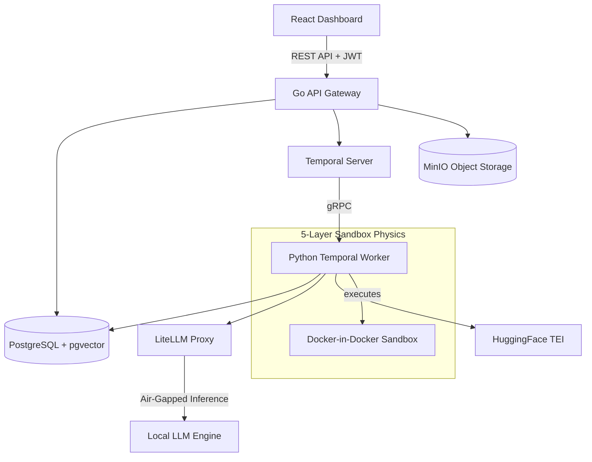

# Architecture and Security Overview

This document outlines the system architecture and security boundaries for **Project Hydra**, explicitly designed for CISO review and InfoSec engineering teams.

## High-Level Architecture

Hydra utilizes a distributed, 8-container Docker Compose stack to decouple the web tier from the state-machine orchestration and generative inference components.

### The 8-Container Stack

1. **hydra-api**: A highly concurrent Go (Gin) API Gateway handling RGBAC, tenant isolation, and RESTful routing.
2. **hydra-worker**: A Python Temporal worker managing the autonomous investigation state machine and executing generated scripts.
3. **hydra-temporal**: The workflow orchestration engine ensuring exactly-once execution, durable timers, and retry logic.
4. **hydra-postgres**: The central relational database, enhanced with `pgvector` for Episodic Security Memory and `pg_trgm` for keyword matching.
5. **hydra-litellm**: An inference routing proxy allowing the worker codebase to seamlessly interface with local, sovereign LLM engines via standard protocols.
6. **hydra-embedding**: A local HuggingFace Text Embeddings Inference (TEI) server for converting logs and methodologies into densely packed vector embeddings.
7. **hydra-minio**: An S3-compliant object store handling log uploads and forensic artifact retention.
8. **hydra-dashboard**: A modern React/TypeScript/Tailwind CSS frontend for SOC analysts.

## Human-in-the-Loop AI Workflow

Hydra avoids the chaotic "agentic loop" problem by enforcing a highly deterministic state machine orchestrated by Temporal.

1. **Trigger**: An investigation is triggered via manual UI input or SIEM integration.
2. **Contextual Retrieval**: The worker queries the **Hydra Intelligence Fabric** to pull the best SOP-aligned methodology for the threat type.
3. **Methodology Mapping**: The LLM maps the logs to the methodology, explicitly preventing unprompted hallucination.
4. **Deterministic Script Generation**: The LLM outputs a Python containment script (or utilizes a pre-approved template).
5. **Human Approval Gate**: Execution halts. The script is sent to the pending approvals queue. A Tier-1 or Tier-2 analyst must cryptographically review and approve the action.
6. **Execution**: Once approved, the script is routed to the Sandbox.

### The 5-Layer Sandbox Physics

All generated code is executed within an ephemeral Docker-in-Docker container bound by strict "physics":

1. **Network Isolation**: The sandbox resides on a bridge network disconnected from the host and internal APIs (`--network none` default stance).
2. **Seccomp Profiling**: A custom seccomp profile drops over 60 dangerous syscalls, preventing kernel exploitation and privilege escalation.
3. **AST Pre-Filtering**: Before any Python code enters the sandbox, a Python Abstract Syntax Tree (AST) parser scans for forbidden modules (`os.system`, `subprocess`, `pty`, socket manipulation).
4. **Resource Limits (Cgroups)**: The container is strictly capped on CPU shares and RAM allocation, preventing memory-based Denial of Service.
5. **Kill Timers**: An unyielding 30-second temporal timeout ensures infinite loops or stalled executions are ruthlessly terminated.

## RBAC and Tenant Isolation

Hydra enforces strict multi-tenancy at the database level. Every REST endpoint forces a `tenant_id` extraction from the decoded JWT. The API injects this `tenant_id` into every SQL statement, logically ensuring that cross-tenant data leakage is mathematically impossible within the relational domain. Roles (`admin`, `analyst`, `viewer`) gate the invocation of destructive or sensitive state transitions (e.g., bypassing approvals).
