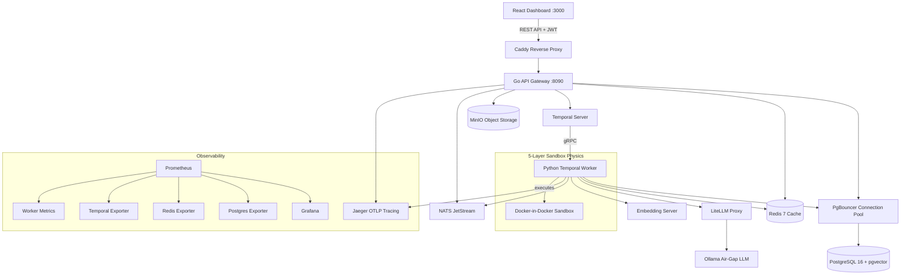

# Architecture and Security Overview

**Version: v0.10.1-security | Date: 2026-03-14**

This document outlines the system architecture and security boundaries for **Project Hydra**, explicitly designed for CISO review and InfoSec engineering teams.

## High-Level Architecture

Hydra utilizes a distributed, 21-service Docker Compose stack spanning inference, orchestration, observability, messaging, and a hardened web tier. Only two ports are exposed to the host network: the Go API gateway (8090) and the React dashboard (3000). All other services communicate exclusively on an internal bridge network.

### The 21-Service Stack

| # | Service | Role |
|---|---------|------|
| 1 | **hydra-api** | Go (Gin) API gateway — RBAC, tenant isolation, OIDC SSO, RESTful routing |
| 2 | **hydra-worker** | Python Temporal worker — investigation state machine, script execution |
| 3 | **hydra-dashboard** | React 19 / TypeScript / Tailwind 4 SOC analyst frontend |
| 4 | **hydra-temporal** | Workflow orchestration — exactly-once execution, durable timers, retries |
| 5 | **hydra-temporal-ui** | Temporal web console for workflow inspection |
| 6 | **hydra-postgres** | PostgreSQL 16 + pgvector (episodic memory) + pg_trgm (keyword matching) |
| 7 | **hydra-pgbouncer** | Connection pooling — limits DB connection exhaustion |
| 8 | **hydra-redis** | 256 MB LRU cache — rate limiting, session state, investigation cache |
| 9 | **hydra-litellm** | LLM inference routing proxy (fast / standard / reasoning tiers) |
| 10 | **hydra-ollama** | Air-gapped local LLM engine (sovereign inference fallback) |
| 11 | **hydra-embedding** | Local embedding server — 768-dim vectors for RAG retrieval |
| 12 | **hydra-nats** | NATS JetStream — 100k/sec alert buffering, anti-stampede coalescing |
| 13 | **hydra-minio** | S3-compliant object store — log uploads, forensic artifact retention |
| 14 | **hydra-caddy** | Reverse proxy / TLS termination |
| 15 | **hydra-jaeger** | Distributed tracing (OTLP) |
| 16 | **hydra-prometheus** | Metrics collection and alerting (6 alert rules) |
| 17 | **hydra-grafana** | 3 monitoring dashboards |
| 18 | **hydra-postgres-exporter** | PostgreSQL metrics exporter |
| 19 | **hydra-redis-exporter** | Redis metrics exporter |
| 20 | **hydra-temporal-exporter** | Temporal metrics exporter |
| 21 | **hydra-worker-metrics** | Worker performance metrics exporter |

## Human-in-the-Loop AI Workflow

Hydra avoids the chaotic "agentic loop" problem by enforcing a highly deterministic state machine orchestrated by Temporal.

1. **Trigger**: An investigation is triggered via manual UI input or SIEM integration.
2. **Contextual Retrieval**: The worker queries the **Hydra Intelligence Fabric** to pull the best SOP-aligned methodology for the threat type.
3. **Methodology Mapping**: The LLM maps the logs to the methodology, explicitly preventing unprompted hallucination.
4. **Deterministic Script Generation**: The LLM outputs a Python containment script (or utilizes a pre-approved template).
5. **Human Approval Gate**: Execution halts. The script is sent to the pending approvals queue. A Tier-1 or Tier-2 analyst must cryptographically review and approve the action.
6. **Execution**: Once approved, the script is routed to the Sandbox.

### The 5-Layer Sandbox Physics

All generated code is executed within an ephemeral Docker-in-Docker container bound by strict "physics":

1. **Network Isolation**: The sandbox resides on a bridge network disconnected from the host and internal APIs (`--network none` default stance).
2. **Seccomp Profiling**: A custom seccomp profile drops over 60 dangerous syscalls, preventing kernel exploitation and privilege escalation.
3. **AST Pre-Filtering**: Before any Python code enters the sandbox, a Python Abstract Syntax Tree (AST) parser scans for forbidden modules (`os.system`, `subprocess`, `pty`, socket manipulation).
4. **Resource Limits (Cgroups)**: The container is strictly capped on CPU shares and RAM allocation, preventing memory-based Denial of Service.
5. **Kill Timers**: An unyielding 30-second temporal timeout ensures infinite loops or stalled executions are ruthlessly terminated.

## RBAC and Tenant Isolation

Hydra enforces strict multi-tenancy at the database level. Every REST endpoint forces a `tenant_id` extraction from the decoded JWT. The API injects this `tenant_id` into every SQL statement, logically ensuring that cross-tenant data leakage is mathematically impossible within the relational domain. Roles (`admin`, `analyst`, `viewer`) gate the invocation of destructive or sensitive state transitions (e.g., bypassing approvals).

## v0.10.1 Security Hardening

The following fixes were shipped in v0.10.1-security (tag `v0.10.1-security`, 5 commits) to address findings from the v0.10.0 security audit:

### Infrastructure Port Closure

All internal services (PostgreSQL, Redis, Temporal, NATS, LiteLLM, MinIO, embedding server) use Docker `expose` only and are **not** bound to the host network. Only two host-accessible ports remain:

| Port | Service | Purpose |
|------|---------|---------|
| 8090 | Go API Gateway | All REST/auth traffic |
| 3000 | React Dashboard | SOC analyst UI |

### JWT and Session Security

- **Access tokens**: 15-minute expiry (reduced from 24 hours). Stored in JavaScript memory only — never written to `localStorage` or `sessionStorage`.
- **Refresh tokens**: 7-day expiry, issued in `httpOnly` + `SameSite=Strict` cookies. Rotation via `POST /auth/refresh`.
- **Signing method validation**: Only HMAC accepted; algorithm confusion attacks are rejected.
- **JWT_SECRET enforcement**: Server refuses to start if `JWT_SECRET` is fewer than 32 characters. No hardcoded defaults ship in the binary.
- **Logout**: `POST /auth/logout` clears the refresh cookie. Legacy `localStorage` tokens are purged on frontend load.

### OIDC SSO Verification

- ID tokens are verified against the provider's published JWKS endpoint (RSA signatures).
- Issuer (`iss`) and audience (`aud`) claims are validated on every token exchange.
- JWKS key sets auto-refresh on key rotation — no manual intervention required.
- Implemented with Go stdlib (`crypto/rsa`) — zero new dependencies.

### Authentication Rate Limiting

- **Login attempts**: 10 per 15 minutes per source IP.
- **Account lockout**: Triggered after 5 consecutive failed attempts; requires admin unlock.
- Rate limits are enforced at the API middleware layer before credential verification.

### Database Authentication

- PostgreSQL connections use **SCRAM-SHA-256** authentication (replaces md5).
- Connection pooling via PgBouncer limits max connections and prevents exhaustion attacks.

### Frontend Security Posture

- Access token held in a JavaScript closure — inaccessible to XSS-injected scripts reading `localStorage`.
- All API calls use `fetchWithRefresh()` which auto-retries on 401 with the httpOnly refresh cookie.
- Legacy `localStorage` token entries are explicitly deleted on application bootstrap.
