# Autonomous SOC Investigation on Air-Gapped Infrastructure: Architecture, Benchmarks, and Limitations of the ZOVARK Platform

**Authors:** ZOVARK Development Team
**Version:** 1.5.1 (March 2026)
**Classification:** Public

---

## Abstract

Security operations centers process an average of 11,000 alerts per day, with false positive rates exceeding 70%. Tier-1 analysts spend 30-60 minutes per investigation, creating unsustainable backlogs that allow genuine threats to dwell undetected for a median of 10 days. Simultaneously, data sovereignty regulations---GDPR, HIPAA, NERC CIP, CMMC Level 2---prohibit many organizations from transmitting security telemetry to cloud-based AI services. This paper presents ZOVARK, an autonomous SOC investigation platform that runs entirely on air-gapped infrastructure using locally-hosted large language models. ZOVARK implements a five-stage investigation pipeline orchestrated by Temporal workflows: alert ingestion with deduplication and PII masking, LLM-driven code generation using skill templates, sandboxed execution with AST prefiltering and seccomp containment, LLM-powered verdict assessment, and structured evidence storage. We evaluate ZOVARK against the OWASP Juice Shop benchmark corpus of 100 real-traffic attack alerts, achieving 100% attack detection across all 100 investigations with an average investigation time of 15 seconds for template-based and 90 seconds for full LLM investigations---approximately 140x faster than manual analyst triage. The system runs on a single NVIDIA RTX 3050 (4GB VRAM) using a quantized Qwen2.5-14B model with zero data egress, demonstrating that meaningful SOC automation is feasible on consumer-grade hardware within fully isolated networks.

---

## 1. Introduction

### 1.1 The SOC Alert Fatigue Crisis

Modern security operations centers face an intractable scaling problem. Enterprise SIEM platforms generate between 5,000 and 50,000 alerts per day, depending on organizational size and detection rule coverage. Industry surveys consistently report that 70-80% of these alerts are false positives or benign true positives requiring no action, yet each must be triaged by a human analyst to reach that determination. The Ponemon Institute's 2025 SOC Efficiency Report found that the average Tier-1 analyst investigates 25-40 alerts per shift, with a mean investigation time of 36 minutes per alert. This arithmetic---thousands of alerts, dozens of analysts, minutes per investigation---produces chronic backlogs.

The consequences are measurable. CrowdStrike's 2025 Global Threat Report documented a median attacker dwell time of 10 days across their customer base, driven primarily by alert queue saturation rather than detection failure. The alerts existed; they simply were not investigated in time. This is not a detection problem. It is a triage throughput problem.

### 1.2 The Data Sovereignty Constraint

The obvious solution---cloud-based AI investigation services---is unavailable to a significant market segment. Organizations subject to GDPR Article 44 (restrictions on data transfers outside the EU), HIPAA's minimum necessary standard, NERC CIP-004 through CIP-011 (bulk electric system cyber security), and CMMC Level 2 (controlled unclassified information) face legal or contractual prohibitions against transmitting raw security telemetry to third-party cloud services.

Every major SOC automation vendor today---CrowdStrike Charlotte AI, Microsoft Copilot for Security, Google Chronicle SOAR, Swimlane Turbine---requires cloud connectivity for their AI-powered investigation features. This creates a market gap: the organizations with the most sensitive data and the strictest compliance requirements are the ones least able to adopt AI-assisted security operations.

### 1.3 ZOVARK's Approach

ZOVARK addresses both problems simultaneously. It is an autonomous SOC investigation platform that:

1. Runs entirely on-premises with no outbound network connectivity required
2. Uses locally-hosted quantized language models (4-14B parameters) on commodity GPU hardware
3. Generates and executes investigation code in hardened sandbox containers
4. Produces structured, auditable verdicts with MITRE ATT&CK mapping and risk scores
5. Maintains a complete LLM audit trail for compliance and forensic review

The system is designed for deployment behind air-gap boundaries---physically or logically isolated networks where no data leaves the organization's control. This paper describes the architecture, threat model, evaluation results, and known limitations of the ZOVARK platform as of version 1.1.0.

---

## 2. Architecture

### 2.1 Pipeline Overview

ZOVARK implements a five-stage investigation pipeline orchestrated by Temporal, a durable workflow engine that provides fault tolerance and replay capability.

```mermaid
graph TD
    A[SIEM Alert] --> B[Go API Gateway :8090]
    B --> C[Temporal Workflow Engine]
    C --> D[Stage 1: INGEST]
    D --> E[Stage 2: ANALYZE]
    E --> F[Stage 3: EXECUTE]
    F --> G[Stage 4: ASSESS]
    G --> H[Stage 5: STORE]
    H --> I[Structured Verdict]

    D -->|NO LLM| D1[Dedup via Redis]
    D -->|NO LLM| D2[PII Masking]
    D -->|NO LLM| D3[Skill Template Retrieval]

    E -->|LLM Call 1| E1[Template Fill or Full Code Gen]

    F -->|NO LLM| F1[AST Prefilter]
    F -->|NO LLM| F2[Docker Sandbox]

    G -->|LLM Call 2| G1[Verdict + Risk Score]
    G -->|LLM Call 2| G2[FP Confidence]

    H -->|NO LLM| H1[PostgreSQL Write]
    H -->|NO LLM| H2[Investigation Memory]

    style D fill:#1a3a2a,stroke:#4ade80
    style E fill:#1a2a3a,stroke:#60a5fa
    style F fill:#3a1a1a,stroke:#f87171
    style G fill:#1a2a3a,stroke:#60a5fa
    style H fill:#1a3a2a,stroke:#4ade80
```

**Stage 1 -- INGEST (No LLM):** Receives the alert payload from the Go API, deduplicates against Redis using a content hash, applies regex-based PII masking (email addresses, IP addresses, hostnames are tagged but preserved for investigation), and retrieves the most relevant skill template from a library of 11 pre-validated investigation scripts.

**Stage 2 -- ANALYZE (LLM Call 1):** If a matching skill template is found (the common case for the 11 supported investigation types), the template is populated with alert-specific parameters. If no template matches, the LLM generates investigation code from scratch. This is the first of exactly two LLM calls per investigation.

**Stage 3 -- EXECUTE (No LLM):** The generated Python code passes through an AST prefilter that statically analyzes the abstract syntax tree for forbidden imports (os, sys, subprocess, socket, etc.) and dangerous patterns (eval, exec, __import__). Code that passes the prefilter executes inside a Docker container with network isolation (--network=none), read-only filesystem, seccomp syscall filtering, dropped capabilities (--cap-drop=ALL), memory limits, PID limits, and a 120-second kill timer.

**Stage 4 -- ASSESS (LLM Call 2):** The sandbox output (stdout JSON, stderr, exit code) is sent to the LLM for verdict generation. The model produces a structured assessment including risk score (0-100), findings summary, IOC extraction, false positive confidence estimate, and remediation recommendations.

**Stage 5 -- STORE (No LLM):** The complete investigation record---input alert, generated code, sandbox output, LLM verdict, execution metrics, and MITRE ATT&CK mapping---is written to PostgreSQL. Investigation memory is updated for cross-investigation correlation.

### 2.2 LLM Audit Gateway

All LLM interactions are routed through a centralized audit gateway (`llm_gateway.py`) that logs every request and response with timestamps, token counts, model identifiers, and latency measurements to a dedicated `llm_audit_log` table. This provides the complete provenance chain required by compliance frameworks: for any investigation verdict, an auditor can trace exactly which model produced which output, when, and at what cost.

### 2.3 Model Routing

A YAML-driven model router (`model_config.yaml`) selects the appropriate model tier based on alert severity and investigation type. The current deployment uses Qwen2.5-14B-Instruct (Q4_K_M quantization) via llama.cpp for all tiers on the reference RTX 3050 hardware. Enterprise deployments with larger GPU budgets can configure separate fast (7B), standard (32B), and reasoning (70B+) tiers.

### 2.4 Component Stack

| Component | Technology | Port | Purpose |
|-----------|-----------|------|---------|
| API Gateway | Go + Gin | 8090 | Auth, RBAC, task dispatch |
| Workflow Engine | Temporal 1.24 | 7233 | Durable pipeline orchestration |
| Worker | Python 3.11 | -- | LLM interaction, sandbox execution |
| Database | PostgreSQL 16 + pgvector | 5432 | Investigation storage, embeddings |
| Connection Pool | PgBouncer | 6432 | Database connection management |
| Cache | Redis 7 | 6379 | Dedup, rate limiting, sessions |
| LLM Runtime | llama.cpp | 11434 | Local model inference |
| Dashboard | React 19 + Vite 7 | 3000 | Investigation management UI |

---

## 3. Threat Model

### 3.1 Core Assumption: LLM Output Is Untrusted

ZOVARK treats all LLM-generated content as untrusted input. This is the foundational security assumption. The LLM may generate code that attempts to:

- Import dangerous modules (os, subprocess, socket) for host escape
- Use eval/exec to bypass static analysis
- Encode payloads to evade pattern matching
- Exfiltrate data via network connections
- Consume excessive resources (fork bombs, memory exhaustion)
- Manipulate investigation results to hide threats

### 3.2 Defense Layers

**Layer 1 -- AST Prefilter:** Static analysis of the Python abstract syntax tree blocks forbidden imports and dangerous function calls before any code executes. This catches the majority of naive escape attempts with sub-millisecond latency.

**Layer 2 -- Docker Sandbox:** Code executes inside an ephemeral container with:
- `--network=none`: No network stack. TCP, UDP, DNS, and ICMP are all unavailable.
- `--read-only`: Filesystem is immutable except for a size-limited tmpfs at /tmp.
- `--cap-drop=ALL`: All Linux capabilities removed.
- `--security-opt=no-new-privileges`: Prevents privilege escalation via setuid binaries.
- `--user=65534:65534`: Runs as the nobody user.
- `--pids-limit=64`: Prevents fork bombs.
- `--memory=512m --memory-swap=512m`: Hard memory ceiling with no swap.
- `--cpus=0.5`: CPU throttling.

**Layer 3 -- Seccomp Profile:** A custom seccomp profile restricts available syscalls. Dangerous syscalls (mount, ptrace, kexec_load, reboot, init_module) are explicitly blocked. Raw socket creation is blocked. Clone with CLONE_NEWUSER is blocked to prevent namespace escape.

**Layer 4 -- Kill Timer:** A 120-second execution timeout forcefully terminates any container that exceeds its time budget.

### 3.3 Prompt Injection Mitigation

Alert payloads may contain attacker-controlled content (e.g., malicious email subjects, HTTP request paths). ZOVARK mitigates prompt injection through:

1. **Template-first approach:** 11 of the most common investigation types use pre-validated skill templates where the LLM only fills parameters, not arbitrary code.
2. **PII masking in Stage 1:** Sensitive strings are tagged before reaching the LLM.
3. **Structured output parsing:** The assess stage expects JSON with specific schema fields; freeform text injection has limited attack surface.
4. **Audit logging:** All LLM inputs and outputs are logged for post-hoc review.

### 3.4 Data Exfiltration: Impossible by Design

The sandbox has no network stack. The LLM runs locally. No component requires outbound connectivity. In an air-gapped deployment, data exfiltration via the investigation pipeline is architecturally impossible---there is no network path from the sandbox to any external endpoint.

---

## 4. Evaluation

### 4.1 Hardware Configuration

All benchmarks were conducted on the following reference hardware, chosen to represent the minimum viable deployment:

- **GPU:** NVIDIA GeForce RTX 3050 Laptop (4GB VRAM)
- **CPU:** Intel Core (mobile, 8 cores)
- **RAM:** 16GB DDR4
- **Storage:** NVMe SSD
- **OS:** Windows 11 with Docker Desktop (WSL2 backend)
- **Model:** Qwen2.5-14B-Instruct-Q4_K_M (8.1GB, 20 GPU layers offloaded)
- **Runtime:** llama.cpp (native Windows build)

### 4.2 Model Performance

| Model | Parameters | Quantization | Tokens/sec | VRAM | Use Case |
|-------|-----------|-------------|-----------|------|----------|
| Qwen2.5-14B | 14B | Q4_K_M | ~4 tok/s | 3.8GB | Primary (current) |
| Nemotron-Mini-4B | 4B | Q4_K_M | ~37 tok/s | 1.8GB | Fast triage (planned) |

The 14B model produces higher-quality investigation verdicts but processes at approximately 4 tokens per second on the reference hardware, making it the throughput bottleneck. The 4B model achieves 9x faster inference and is being evaluated for triage-tier investigations where speed matters more than depth.

### 4.3 Juice Shop Benchmark

We constructed a benchmark corpus of 100 real-traffic alerts derived from OWASP Juice Shop, an intentionally vulnerable web application. The corpus includes SQL injection, XSS, authentication bypass, directory traversal, sensitive data exposure, and other OWASP Top 10 attack categories. Each alert was generated from actual attack traffic, not synthetic patterns.

**Results (v1.5.1):**

| Metric | Value |
|--------|-------|
| Total alerts | 100 |
| Completed investigations | 100/100 |
| Attack detection rate | 100% (70/70 attack alerts) |
| False negatives | 0 |
| Verdict accuracy (including novel types) | 100% (10/10 LLM-generated) |
| IOCs extracted per investigation | 2-10 |
| Average investigation time (template) | 15 seconds |
| Average investigation time (full LLM) | 90 seconds |
| Template-based investigations | 90/100 |
| LLM-generated investigations | 10/100 |

**Per-Attack-Type Breakdown:**

| Attack Category | Alerts | Detected | Detection Rate |
|----------------|--------|----------|---------------|
| SQL Injection | 15 | 15 | 100% |
| Cross-Site Scripting (XSS) | 12 | 12 | 100% |
| Authentication Bypass | 10 | 10 | 100% |
| Directory Traversal | 8 | 8 | 100% |
| Sensitive Data Exposure | 9 | 9 | 100% |
| Brute Force | 7 | 7 | 100% |
| IDOR/Access Control | 8 | 8 | 100% |

All 100 investigations completed successfully. Infrastructure issues (Docker timeout, LLM queue saturation) that caused failures in earlier versions were resolved through retry logic, template coverage expansion, and LLM gateway timeout tuning. No investigation misclassified an attack as benign.

### 4.4 Throughput Comparison

| Method | Avg Time per Investigation | Throughput |
|--------|--------------------------|-----------|
| Manual analyst (industry avg) | 36 minutes | ~1.7/hour |
| ZOVARK (14B model, RTX 3050) | 90 seconds | ~40/hour |
| ZOVARK (template-only, no LLM) | 15 seconds | ~240/hour |

On the reference hardware, ZOVARK achieves approximately 24x throughput improvement over manual investigation for LLM-powered investigations, and over 140x for template-based fast-fill investigations that bypass the LLM entirely.

---

## 5. Limitations

We document the following known limitations transparently, as honest disclosure is essential for security tooling evaluation.

### 5.1 IOC Extraction Accuracy

IOC (Indicator of Compromise) extraction now yields 2-10 IOCs per investigation. However, the model can occasionally reformat IP addresses, truncate file hashes, or misattribute network indicators. IOCs extracted by ZOVARK should be validated against source data before use in blocking rules or threat intelligence feeds.

### 5.2 Template Dependency

The 100% detection rate is achieved primarily through pre-validated skill templates that encode expert investigation logic. For alert types that do not match any template, the LLM must generate investigation code from scratch. The quality and reliability of generated code for novel alert types has not been systematically evaluated at scale.

### 5.3 Single-GPU Throughput

On the reference RTX 3050, the 14B model processes one investigation at a time due to VRAM constraints. With retry logic and gateway timeout tuning, all 100 benchmark investigations now complete successfully, but sustained alert volumes above ~40/hour will queue behind the LLM. Production deployments targeting higher throughput should use dedicated inference hardware (A6000/A100 class), smaller models (Nemotron 4B), or the tiered approach using templates for common alerts and LLM for novel ones.

### 5.4 No PCAP or Full Packet Analysis

ZOVARK operates on structured alert data (SIEM alert JSON), not raw network captures. It cannot perform deep packet inspection, payload reconstruction, or protocol analysis. Integration with network forensics tools (Zeek, Suricata) is planned but not implemented.

### 5.5 DPO Alignment: Planned, Not Completed

A Direct Preference Optimization (DPO) training pipeline exists in the codebase (`dpo/`) but has not yet been applied to production model weights. The current model uses base instruction-tuned weights without domain-specific alignment to security investigation tasks.

### 5.6 False Positive Discrimination

ZOVARK reliably detects attacks but has difficulty confidently classifying benign traffic. Benign HTTP requests to Juice Shop (e.g., legitimate product browsing) were sometimes assigned risk scores of 40-55, where the target for benign traffic is below 30. The false positive confidence estimator requires further calibration.

---

## 6. Related Work

### 6.1 Commercial SOC AI Platforms

**CrowdStrike Charlotte AI** integrates with the Falcon platform to provide natural language investigation queries and automated triage. It requires CrowdStrike's cloud infrastructure and processes telemetry on CrowdStrike-managed endpoints.

**Microsoft Copilot for Security** leverages GPT-4 integrated with Microsoft Sentinel, Defender, and Intune data sources. It operates entirely within Azure and requires Microsoft 365 E5 or standalone licensing.

**Google Chronicle SOAR** (now part of Google Security Operations) provides automated playbook execution and AI-powered investigation summaries. It requires Google Cloud connectivity and processes data within Google's infrastructure.

**Swimlane Turbine** offers low-code SOAR automation with AI assist capabilities. The AI features require cloud connectivity for model inference.

### 6.2 Open Source and Research

**NVIDIA NemoClaw** (2025) demonstrated agentic security analysis using the Nemotron model family. It runs as a cloud service and requires NVIDIA GPU Cloud (NGC) infrastructure, though the models themselves could theoretically be self-hosted.

**LLM-based log analysis** research (various, 2024-2025) has explored using language models for security log interpretation, primarily focused on cloud-deployed models analyzing logs shipped to external infrastructure.

### 6.3 Key Differentiator

ZOVARK is, to our knowledge, the only SOC investigation platform that:
1. Runs the complete investigation pipeline (LLM inference, code generation, sandbox execution, verdict generation) on a single machine with no cloud connectivity
2. Operates on consumer-grade GPU hardware (4GB VRAM)
3. Provides a four-layer sandbox containment model specifically designed for LLM-generated security investigation code
4. Maintains a complete LLM audit trail at the investigation level

---

## 7. Conclusion

ZOVARK demonstrates that autonomous SOC investigation is feasible on air-gapped infrastructure using consumer-grade hardware. The five-stage pipeline with Temporal orchestration provides fault-tolerant, auditable investigation execution. The four-layer sandbox model (AST prefilter, Docker isolation, seccomp filtering, kill timer) mitigates the inherent risks of executing LLM-generated code. The 100% completion rate and 100% attack detection rate on the Juice Shop benchmark (100/100 investigations, 70/70 attack alerts) indicates that the template-based investigation approach, augmented by LLM fallback for novel alert types, produces reliable results across common and uncommon attack categories.

The primary bottleneck is single-GPU inference throughput, which limits sustained investigation capacity to approximately 40 LLM-powered investigations per hour on RTX 3050 hardware. Template-based investigations complete in ~15 seconds, enabling ~240 investigations per hour for known alert types. Production deployments targeting higher volumes should budget for dedicated inference hardware (A6000/A100 class) or adopt the tiered model approach.

For organizations constrained by GDPR, HIPAA, NERC CIP, or CMMC requirements, ZOVARK eliminates the data sovereignty concern entirely: no telemetry, no investigation data, and no model interactions leave the organization's network boundary. The complete LLM audit trail provides the provenance documentation these compliance frameworks require.

We are seeking design partners among enterprise SOC teams to validate the platform against production alert volumes and diverse SIEM integrations. The platform is open for evaluation at https://github.com/zovark-soc/zovark-mvp.

---

## References

1. Ponemon Institute. "SOC Efficiency Report." 2025.
2. CrowdStrike. "2025 Global Threat Report." February 2025.
3. MITRE Corporation. "ATT&CK Framework v14." https://attack.mitre.org/
4. OWASP Foundation. "Juice Shop." https://owasp.org/www-project-juice-shop/
5. Temporal Technologies. "Temporal: Durable Execution." https://temporal.io/
6. Qwen Team. "Qwen2.5 Technical Report." 2024.
7. NVIDIA. "NemoClaw: Agentic Security Analysis." 2025.
8. European Parliament. "General Data Protection Regulation (GDPR)." Regulation 2016/679.
9. U.S. Department of Defense. "CMMC 2.0 Framework." 2024.
10. NERC. "Critical Infrastructure Protection Standards CIP-004 through CIP-011." 2024.
